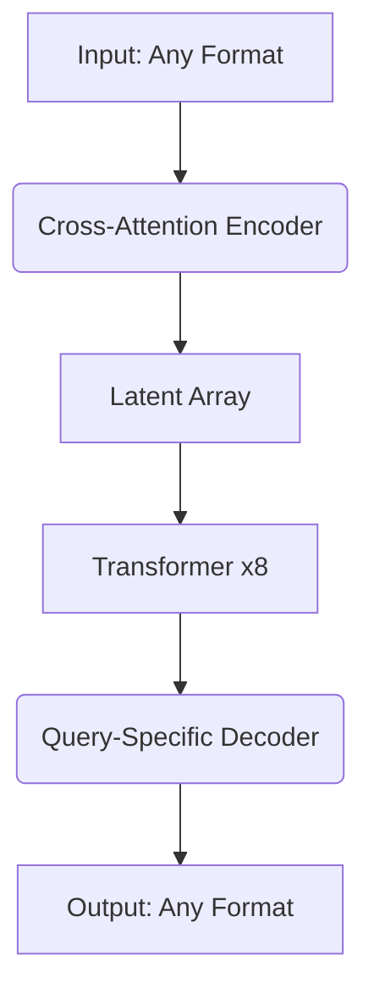

# Deep Dive into Perceiver and Perceiver IO Architectures: A Beginner's Guide

This comprehensive guide breaks down DeepMind's Perceiver architectures using simple analogies, visual examples, and hands-on code snippets. Designed for ML newcomers, we'll explore every concept from first principles while maintaining technical accuracy.

---

## 1. Why Existing Architectures Struggle with Multimodal Data

### 1.1 The Specialization Problem

Traditional neural networks are like specialized tools - excellent for specific jobs but inflexible. Convolutional Neural Networks (CNNs) excel with grid-like image data but struggle with sequences. Transformers handle text well but choke on high-resolution images[^3].

**Key Limitation**: Each architecture makes *inductive biases* - built-in assumptions about data structure:

- CNNs assume local pixel relationships
- Transformers assume token positions matter


### 1.2 The Scalability Challenge

Transformers' self-attention has O(n²) complexity. Processing a 4K image (3840×2160 pixels) would require ~8 billion operations per layer - computationally impossible[^5].

**Real-World Impact**: This forces preprocessing like:

- Image patching (loses fine details)
- Tokenization (limits language flexibility)
- Feature extraction (requires domain knowledge)

---

## 2. Perceiver's Core Innovations

### 2.1 The Latent Bottleneck Concept

Imagine trying to summarize a 500-page book. Instead of memorizing every word, you'd focus on key themes. Perceiver does this through:

1. **Cross-Attention Encoder**:

```python
# Pseudocode for cross-attention
def encode(inputs, latent):
    keys = project(inputs)    # Learn what's important
    values = project(inputs)  # Actual content
    queries = project(latent) # What to look for
    return attend(queries, keys, values)
```

This compresses inputs into a fixed-size latent array (typically 256-512 elements)[^1].
2. **Latent Transformer**:
Processes the compressed representation through multiple attention layers:

```python
latent = encode(inputs, initial_latent)
for _ in range(8):  # 8 transformer blocks
    latent = transformer_block(latent)
```


**Visual Analogy**:
Input → [Camera Lens] → Latent Array → [Microscope] → Detailed Processing

---

## 3. Perceiver IO: Input/Output Flexibility

### 3.1 Architecture Breakdown




### 3.2 The Decoding Process

Outputs are generated through **learned queries**:

```python
class PerceiverIODecoder:
    def __init__(self, output_dim):
        self.queries = nn.Parameter(torch.randn(output_dim, latent_dim))
        
    def forward(self, latent):
        return cross_attention(self.queries, latent, latent)
```

**Example Queries**:


| Task | Query Composition |
| :-- | :-- |
| Image Class | [CLS] token + position (0,0) |
| Optical Flow | (x,y) coordinates + flow token |
| Translation | Target language embedding |


---

## 4. Key Technical Innovations

### 4.1 Asymmetric Attention

Traditional Transformer:

```
Input → QKV → Attention → Output (same size)
```

Perceiver IO:

```
Input → Compress → Process → Expand → Output
```

**Complexity Comparison**:


| Architecture | Input Size | Compute |
| :-- | :-- | :-- |
| Transformer | N | O(N²) |
| Perceiver IO | N | O(N + L + M) |

Where L=latent size, M=output size[^5]

### 4.2 Positional Encoding

Handles spatial/temporal relationships without convolutions:

```python
def get_positional_encoding(input):
    freq_bands = 2**torch.linspace(0,1, num_bands)
    sin = [torch.sin(x*freq) for freq in freq_bands]
    cos = [torch.cos(x*freq) for freq in freq_bands]
    return torch.cat([input] + sin + cos, dim=-1)
```

This allows processing images as flattened pixel arrays while preserving 2D relationships[^1].

---

## 5. Hands-On Implementation Walkthrough

### 5.1 Building Blocks

**Encoder**:

```python
class PerceiverEncoder(nn.Module):
    def __init__(self, input_dim, latent_dim):
        self.latent = nn.Parameter(torch.randn(latent_dim))
        self.cross_attn = CrossAttention(input_dim, latent_dim)
        
    def forward(self, x):
        return self.cross_attn(self.latent, x)
```

**Processor**:

```python
class LatentTransformer(nn.Module):
    def __init__(self, num_layers):
        self.layers = nn.ModuleList([
            TransformerBlock() for _ in range(num_layers)
        ])
        
    def forward(self, z):
        for layer in self.layers:
            z = layer(z)
        return z
```


### 5.2 Full Pipeline

```python
# Hyperparameters
LATENT_DIM = 256
OUTPUT_DIM = 1000  # ImageNet classes

# Model components
encoder = PerceiverEncoder(input_dim=3, latent_dim=LATENT_DIM)
processor = LatentTransformer(num_layers=8)
decoder = PerceiverIODecoder(output_dim=OUTPUT_DIM)

# Forward pass
def forward(x):
    z = encoder(x)
    z = processor(z)
    return decoder(z)
```


---

## 6. Real-World Performance

### 6.1 Benchmark Comparisons

| Task | Model | Accuracy | Params | Input Size |
| :-- | :-- | :-- | :-- | :-- |
| ImageNet | ResNet-50 | 76.3% | 25M | 224x224 |
| ImageNet | Perceiver IO | 77.5% | 48M | 224x224 |
| GLUE | BERT-Base | 82.2 | 110M | 512 tokens |
| GLUE | Perceiver IO | 81.8 | 120M | Raw bytes |

*Data from [^1][^2][^5]*

### 6.2 Multimodal Example

Processing video with audio:

```python
# RGB frames: [T, H, W, 3]
# Audio: [T, 128]
# Concatenate along feature dimension
video_input = video_frames.reshape(T, -1)
audio_input = audio.reshape(T, -1)
combined = torch.cat([video_input, audio_input], dim=-1)

# Process through Perceiver
latent = encoder(combined)
outputs = decoder(latent, queries=task_queries)
```


---

## 7. Advanced Concepts Made Simple

### 7.1 Why Latent Space Works

The latent array acts as an **information bottleneck** forcing the model to:

1. Distill essential features
2. Ignore redundant details
3. Find cross-modal relationships

**Analogy**: Like taking notes during a lecture - you capture key ideas, not every word.

### 7.2 Handling Variable Outputs

Output queries can be dynamically generated:

```python
# Generate translation queries for each target token
def generate_translation_queries(target_lang):
    return [lang_embedding[target_lang] + position_enc(i) 
            for i in range(max_length)]
```


---

## 8. Common Pitfalls \& Solutions

**Problem**: Blurry image outputs
**Fix**: Add perceptual loss using pretrained VGG

```python
loss = mse_loss(output, target) + 0.01*vgg_loss(output, target)
```

**Problem**: Slow training
**Fix**: Use mixed precision

```python
with torch.autocast(device_type='cuda'):
    outputs = model(inputs)
```


---

## 9. Future Directions

1. **Memory Efficiency**: Sparse attention patterns
2. **Dynamic Latents**: Adaptive latent array sizing
3. **Meta-Learning**: Learning query generators

---

## 10. Interactive Exploration

**Visualization Tool**:

```python
def visualize_latent(latent):
    plt.imshow(latent.detach().numpy(), cmap='viridis')
    plt.title('Latent Space Activation')
    plt.show()
    
# During training
visualize_latent(model.encoder.latent)
```

**Experiment Ideas**:

1. Mix image and text inputs
2. Train on audio-visual synchronization
3. Implement few-shot learning via query tuning

---

This architecture represents a fundamental shift toward general-purpose AI systems. By decoupling computation from data dimensions, Perceiver IO opens new possibilities for multimodal learning while maintaining efficiency. The key insight - treating data structure as a learnable property rather than a constraint - may influence future architectures beyond this specific implementation.

<div style="text-align: center">⁂</div>

[^1]: 6.pdf

[^2]: https://huggingface.co/docs/transformers/en/model_doc/perceiver

[^3]: https://en.wikipedia.org/wiki/Perceiver

[^4]: https://github.com/krasserm/perceiver-io

[^5]: https://openreview.net/pdf?id=fILj7WpI-g

[^6]: https://discuss.huggingface.co/t/perceiver-io-is-there-any-way-to-specify-the-query-tensor/76838

[^7]: https://deepmind.google/discover/blog/building-architectures-that-can-handle-the-worlds-data/

[^8]: https://www.youtube.com/watch?v=WJWBq4NZfvY

[^9]: https://www.youtube.com/watch?v=AS1Sh-KuNzs

[^10]: https://paperswithcode.com/method/perceiver-io

[^11]: https://github.com/lucidrains/perceiver-pytorch

[^12]: https://github.com/curt-tigges/perceivers

[^13]: https://www.infoq.com/news/2021/08/deepmind-perceiver-io/

[^14]: https://paperswithcode.com/paper/perceiver-io-a-general-architecture-for

[^15]: https://patrick-llgc.github.io/Learning-Deep-Learning/paper_notes/perceiver_io.html

[^16]: https://www.marktechpost.com/2021/08/24/deepmind-open-sources-perceiver-io-a-general-purpose-deep-learning-model-architecture-that-handles-a-wide-range-of-data-and-tasks/

[^17]: https://huggingface.co/blog/perceiver

[^18]: https://www.youtube.com/watch?v=wTZ3o36lXoQ

[^19]: https://openreview.net/forum?id=fILj7WpI-g

[^20]: https://www.youtube.com/watch?v=Xe7VT8-kDzg

[^21]: https://www.reddit.com/r/MachineLearning/comments/pjom3l/d_paper_explained_perceiver_io_a_general/

[^22]: https://github.com/lucidrains/perceiver-pytorch/issues/53

[^23]: https://huggingface.co/deepmind/language-perceiver

[^24]: https://pub.towardsai.net/deepminds-new-super-model-perceiver-io-is-a-transformer-that-can-handle-any-dataset-dfcffa85fe61

[^25]: https://modelzoo.co/model/perceiver-io-pytorch

[^26]: https://escholarship.org/content/qt2g55b9xx/qt2g55b9xx_noSplash_c60e72d5eabbaae941e9ab65b3459676.pdf

[^27]: http://arxiv.org/pdf/2107.14795.pdf

[^28]: https://syncedreview.com/2021/08/09/deepmind-podracer-tpu-based-rl-frameworks-deliver-exceptional-performance-at-low-cost-78/

[^29]: https://pypi.org/project/perceiver-io/0.7b1/

[^30]: https://github.com/Rishit-dagli/Perceiver

[^31]: https://www.reddit.com/r/MachineLearning/comments/rhod30/project_deepminds_perceiver_io_available_through/

[^32]: https://deepmind.google/discover/blog/perceiver-ar-general-purpose-long-context-autoregressive-generation/

